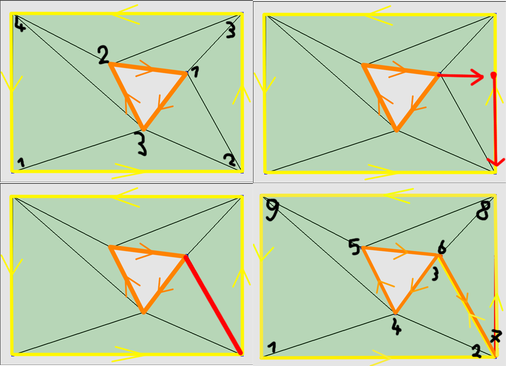
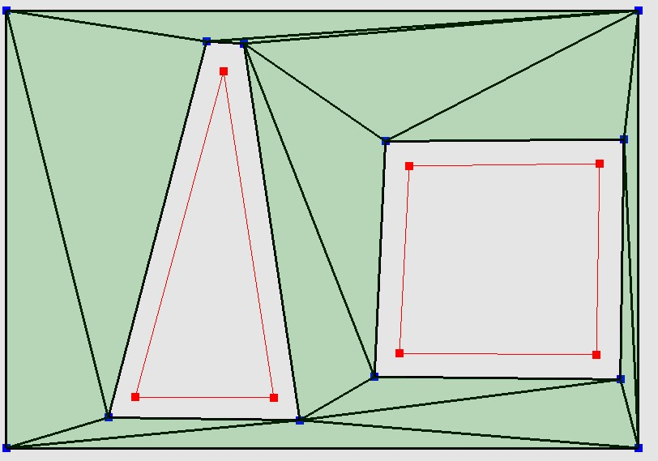
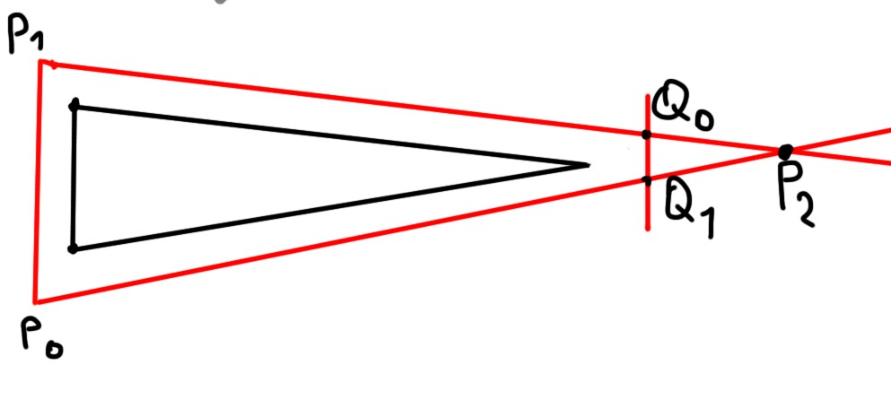

# NavMeshGenerator
Navigation mesh generation using the ear clipping algorithm 
Made by Stegen Sander

## Introduction
The video below is a small demonstration of the finished project.
* The nav mesh support:
  *	Triangulation by ear clipping.
  *	Insetting of vertices to avoid wall collisions.
  *	Meshes with holes/obstacles inside  
  
* The nav mesh does not support:
  * Overlapping obstacles
  * Obstacle outside of the boundaries
   

## Implementation
#### Framework
I used a very basic framework, that was provided to me in my first year of Game Development at Howest Belgium. The framework contains basic draw functionalities and raycasting 
#### Standards
It is important to set a standard of your vertices winding since a lot of functionalities will be influence by it. The vertices list (the main polygon/boundaries) were always defined in Counterclockwise order. The obstacles/holes can be created in both clockwise and counterclockwise order but will always be stored internally as clockwise. 
#### Graph Class
The nav mesh itself is stored in a graph, with hold a collection of Nodes, and a collection of Connections between these nodes. 
#### Astar Class
In the project I included an Astar pathfinding implementation although it is currently not active, and it does not support efficient nav mesh pathfinding. It will always find a correct path though. 
#### NavigationMesh Class
This class does the hard work, it does the following (in order): 
*	Create our initial Vertices List.
*	Inset all vertices (if turned on).
*	Check if obstacles are valid and meet certain requirements to prevent crashes.
*	Insert the obstacles at the correct place in the Vertices List.
*	Run ear clipping on the vertices list.
*	Generate a graph from the data.  

## The ear clipping algorithm
The ear clipping algorithm is an algorithm used for triangulation of polygon which is what we want, but there are a few complications with using this.  
How does the algorithm work? 
The algorithm takes a list of points/vertices, then it loops over all points and checks if 3 adjacent point form an ear. An ear is defined as a convex triangle that can be formed without being obstructed by any other point in the mesh. Once we have an ear, we know that the vertices of this ear can be triangulated, we store the connection, remove the ear from the mesh and continue.
After clipping all the ears from our mesh we end up with a triangulated polygon  

### Meshes with a hole
Although ear clipping works fine on regular meshes, it does not work properly on meshes with a hole because the holes are not part of the original list of vertices. To use the ear clipping on meshes with a hole, we first need to get rid of the holes.  
We can accomplish this by finding ourselves a point to attach our hole to. Let us take the mesh (rectangle) and the hole (triangle) pictured below. to connect the hole to the mesh it looks quite easy for the human eye but is quite difficult for computers. One of the simpler ways to connect the hole is finding the most right point of our hole and from this point we draw a line to the right. At some point the line will intersect with the outside mesh. When we found this intersection point, we can trace along this line until we find a point that it part of the outside mesh. We now want to insert the vertices of the hole after the correct point in our vertices list. When doing this correctly we should end up with a polygon without a hole like shown below  

### Obstructed connections
The method of connecting a whole to the outside mesh is also not waterproof. When working with multiple holes the connection we want to form with the outside mesh can be obstructed like shown in the image below.   
To prevent this form happening we want to check if we can see the vertex of the outside mesh we want to connect to and if this connection is not possible, we actually want to connect to the hole that is obstructing us.  

### Multiple connections to the same point
There is another issue that (might) needs attention. This problem is depending on the implementation you are using.  
When connecting 2 holes to the same points be careful in which order they get attached. Look at the examples below and see that there are 2 ways of connection to the same point. 1 of the 2 ways clearly messes with the order your vertex list. To prevent this note that (depending on the winding of your polygon) the lower hole always has to come first in the final vertices list  

## Inset vertices

Since a navigation mesh is used to guide AI entities through a level and they will always have a certain size, we need to prevent the entities from getting stuck against walls. We do this by offsetting the vertices of the obstacles.  
To accomplish this, we look at the corners of the obstacle and move them along the normal of the 2 vectors creating this corner  

  

There is a special case being handled when the angles become really sharp angles. If you look at the image below, you can see that we would normally end up with the Triangle P0, P1, P2 after insetting.  
Instead, we cut the top of the triangle and add an extra vertex to the obstacle, this is to avoid insets being way too big and keeps the nav mesh efficient at the cost of extra geometry. 

## Possible optimisations
#### Delaunay triangulation
Delaunay Triangulation optimises the area of triangles, preventing very small triangles that often occur using ear clipping
#### Custom optimisation
When doing research on other NavMesh algorithms, I realised that a navmesh doesn't have to be a triangulated shape. A navmesh just exists to show an AI where he can go from the current location he is at. There are already NavMesh generation algorithms that don't use triangulated shapes (ex: Wavefront Edge Expansions algorthims).
When a navmesh is not triangulated we just need to treat our pathfinding differently. So instead of optimising the area of the triangle, we can just remove connections to turn the triangles in higher order polygons with a bigger area. As long as all points of the smaller polygon are visible from each point of the polygon we have a useable navigation mesh

## Sources
https://www.geometrictools.com/Documentation/TriangulationByEarClipping.pdf
https://en.wikipedia.org/wiki/Curve_orientation
http://www.gameaipro.com/GameAIPro/GameAIPro_Chapter19_Creating_High-Order_Navigation_Meshes_through_Iterative_Wavefront_Edge_Expansions.pdf
